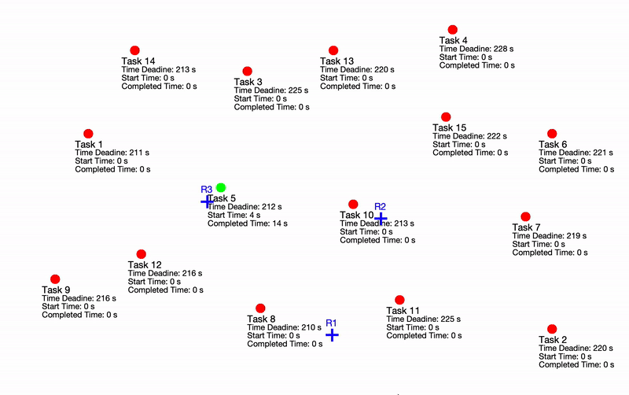

Learning Scalable Policies over Graphs for Multi-Robot Task Allocation using Capsule Attention Networks
(CapAM)

This repository contains the code for the implementation of Capsule based attention networks aka CapAM, for solving a Single-Task Robot Single Robot-Task (SR-ST) Multi-Robot Task Allocation problem.
Environment:
    The SR-ST MRTA environment can be initialized using the MRTA class inside problem/mrta/problem_mrta.py. All the state space variables and the necessary functions
    to update the state space are implemented using the StateMRTA class inside problem/mrta/state_mrta.py
The training.py implements a REINFORCE algorithm

How to use the code:

    Training:
        To start training run the run.py file. The options.py can be used for different environement settings such as number of taks, number of robots
        and other parameters.
        The trained models for each epoch will be stored in a directory named 'outputs'
        We recommend using a GPU for training.

    Evaluation:
        The datasets for testing can be found inside the directory named 'data'. Run the eval.py file with the path to the dataset, specify the number of tasks,
        and the number of agents.

    Test data generation:
        More test data with varying number of taks can be generated using the script generate_mrta_data.py

Dependencies:
    The code is written in Python. We recommend using Python 3.7. The required packages can be found in the file environment.yml.

Citation:

    Please cite our work if you find it useful.
Paul, S., Ghassemi, P. and Chowdhury, S., 2022, May. Learning Scalable Policies over Graphs for Multi-Robot Task Allocation using Capsule Attention Networks. In 2022 International Conference on Robotics and Automation (ICRA) (pp. 8815-8822). IEEE. (https://ieeexplore.ieee.org/abstract/document/9812370/)

    
    Bibtex: 
   @inproceedings{paul2022learning,
   
  title={Learning Scalable Policies over Graphs for Multi-Robot Task Allocation using Capsule Attention Networks},
  
  author={Paul, Steve and Ghassemi, Payam and Chowdhury, Souma},
  
  booktitle={2022 International Conference on Robotics and Automation (ICRA)},
  
  pages={8815--8822},
  
  year={2022},
  
  organization={IEEE}
}

If you have any questions or concerns, please raise an issue or email: stevepau@buffalo.edu
                
                
